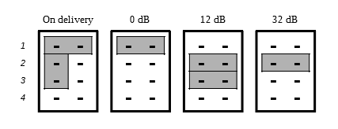

# HiFiBerry DAC+ ADC @beatbridge

 

### Input P6 gain jumper settings
The jumper block is used to configure the input stage. \
In most cases it is recommended to the the default setting without additional input gain. \
32db gain can be used to connect dynamic microphones.  \
Jumpers are numbered from top to the bottom.

---
 

### Input P6 connector 
This allows you to connect an alternative input connector. \
[1] = right + \
[2]	x \
[3]	= ground \
[4]	x \
[5]	= left + \

---
 

### Resources
* **Datasheet** - https://www.hifiberry.com/docs/data-sheets/datasheet-dac-adc/

